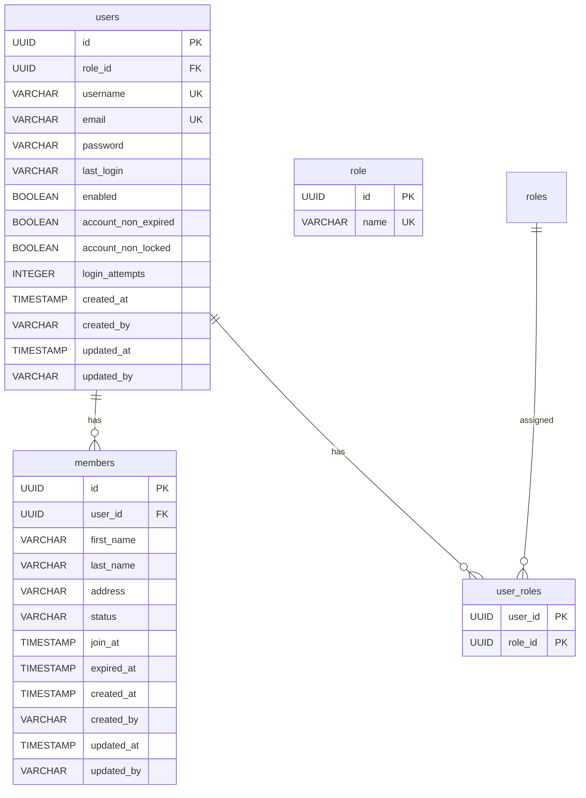

# Aplikazi #

## Fitur Aplikasi ##
Aplikazi akan mencakup modul-modul utama sebagai berikut:
  * **Modul Autentikasi & Manajemen Pengguna:**
    * Login / Logout (Anggota, Pustakawan, Admin)
    * Manajemen akun pengguna (Admin)
    * Tambah, ubah, hapus pengguna (oleh admin).
    * Atur role (admin, pustakawan, anggota) 
    * Ganti password & pemulihan akun.  
  * **Modul Keanggotaan:**
    * Registrasi anggota baru (Pustakawan/Admin).
    * Edit data anggota.
    * Nonaktifkan anggota (misalnya jika sudah lulus atau melanggar aturan).
    * Cetak kartu anggota.
  * **Modul Koleksi Buku:**
    * Input buku baru (judul, penulis, penerbit, ISBN, kategori).
    * Update data buku.
    * Hapus data buku.
    * Manajemen stok eksemplar (copy buku).
  * **Modul Peminjaman & Pengembalian:**
    * Peminjaman buku (oleh pustakawan).
    * Pengembalian buku.
    * Perpanjangan pinjaman (oleh pustakawan atau anggota melalui portal).
    * Denda keterlambatan (otomatis dihitung).
  * **Modul Reservasi:**
    * Reservasi buku (oleh anggota login). 
    * Persetujuan/penolakan reservasi (oleh pustakawan). 
    * Notifikasi ketersediaan buku.  
  * **Modul Koleksi Digital (Opsional):**
    * Akses e-book (anggota login).
    * Download/online reading sesuai hak akses. 
  * **Modul Laporan:**
    * Laporan peminjaman per periode.
    * Laporan denda.
    * Laporan stok buku.
    * Laporan aktivitas anggota.
## Pengguna Aplikasi ##
  * **Admin**
  * **Pustakawan (Petugas)**
  * **Anggota (login)**
## Technology Stack ##
* Java 17
* Spring Boot 3.5.4
* MySQL

# Commit Convention

Agar riwayat commit lebih rapi, mudah dibaca, dan konsisten, gunakan aturan commit berikut.

---

## Format Pesan Commit

### Aturan:
1. **type** → Jenis perubahan (lihat daftar di bawah).
2. **scope** (opsional) → Bagian spesifik dari project yang terpengaruh (misal: `api`, `auth`, `db`).
3. **short summary** → Ringkasan singkat, diawali huruf kecil, maksimal ±50 karakter.

---

## Daftar `type`

| Type       | Deskripsi                                                                 |
|------------|---------------------------------------------------------------------------|
| **feat**   | Penambahan fitur baru                                                     |
| **fix**    | Perbaikan bug                                                             |
| **docs**   | Perubahan atau penambahan dokumentasi                                     |
| **style**  | Perubahan tampilan/format (spasi, indentasi, dll) tanpa mengubah logika   |
| **refactor** | Perubahan kode tanpa menambah fitur atau memperbaiki bug                |
| **perf**   | Peningkatan performa                                                      |
| **test**   | Penambahan atau perbaikan unit test                                       |
| **build**  | Perubahan build system atau dependency                                    |
| **ci**     | Perubahan konfigurasi CI/CD                                               |
| **chore**  | Perubahan kecil lain (misal update .gitignore)                            |
| **revert** | Membatalkan commit sebelumnya                                             |

---

## Contoh Commit

- feat(auth): tambah fitur login dengan JWT
- fix(api): perbaiki error 500 saat create user
- docs(readme): update cara menjalankan project
- style(ui): perbaiki padding pada halaman dashboard
- refactor(service): pisahkan logika validasi dari service

## ERD ##

## Testing ##

